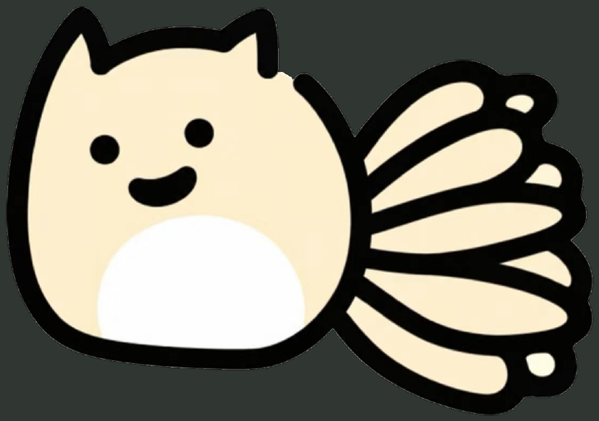

# FoxCursor · 狐萝卜

一个 C# / .NET 8 / WPF 的 Windows 10/11 鼠标伴侣，版本 **v0.1**。
狐萝卜跟随鼠标，点击会做表情，打字时敲小键盘，拖文件时做抱持动作。
角色来自用户提供的原图，保留奶油色、白肚皮和粗黑描边。



> **当前验证状态：** macOS 上完成 Windows 交叉编译及核心逻辑测试。Windows 上的真实输入、混合 DPI、崩溃恢复及 CPU/GPU 表现仍需按 [验收清单](docs/WINDOWS-VALIDATION.md) 实测。本项目不宣称这些实机项目已通过。

## 快速运行

下载或复制完整发布目录，解压后双击 **FoxCursor.exe**。不要单独移动这个 exe，`FoxCursor.Guardian.exe` 等同目录文件也必须保留。

- 本次本地交付的 `FoxCursor-0.1.0-win-x64-framework-dependent.zip` 需要安装 **.NET 8 Desktop Runtime x64**，不是只有 .NET 基础运行时。
- `scripts/publish.ps1` 默认生成包含运行时的 portable 包；该包无需另装 .NET。
- 使用普通用户权限即可，不安装驱动或服务，也不需要管理员权限。
- 首次普通启动显示设置窗口；关闭设置后继续驻留托盘。
- **紧急退出：Ctrl + Alt + F12**。此组合被占用时程序不会隐藏系统鼠标。
- 想回到普通鼠标：托盘选择 **Restore System Cursor** 或 **Disable FoxCursor**。

[微软 .NET 8 下载页](https://dotnet.microsoft.com/en-us/download/dotnet/8.0)

## 已实现

| 功能 | v0.1 行为 |
| --- | --- |
| 原生输入与覆盖层 | 保留 Windows 输入，透明置顶窗口；鼠标穿透、不激活、不进入任务栏 |
| 跟随与定位 | 全局鼠标 Hook、事件合并、物理屏幕坐标；每屏 DPI 补偿、负坐标支持 |
| 外观 | 大小、透明度、XY 偏移、归一化 Hotspot；小圆点显示真实落点 |
| 点击 | 左键压扁、右键倾斜、双击跳跃、长按蓄力；双击采用系统时间与空间阈值 |
| 独立叶子 | 原图身体 / 叶子 PNG 图层，EMA 平滑速度、方向感应、弹簧阻尼回弹、滚轮轻摆 |
| 面部 | 原图 Idle；开心、疑惑、兴奋、用力、专注表情仅覆盖眼嘴区域 |
| 抱文件 | 被动 WinEvent + Shell 列表拖动启发式；小手和通用文件图标，释放 / Escape 恢复 |
| 键盘 | 仅匿名活动状态；小键盘、双手交替，按键频率影响节奏，约 650ms 后恢复 |
| 待机 | 8 秒无输入后偶尔进行 1.8 秒轻微动作，间隔带变化；无输入时不持续 60 FPS |
| 托盘 | Enable / Disable、Size、Opacity、Intensity、各动画开关、Startup、Settings、Restore、Quit |
| 设置 | `%LOCALAPPDATA%\FoxCursor\settings.json`，范围校验、损坏回退、延迟合并写入与原子替换 |
| 安全 | 独立 Guardian、紧急快捷键、UI 心跳、退出/异常恢复、会话锁定自动暂停 |

优先级：**Dragging > Clicking > Charging > KeyboardTyping > FastMoving > Moving > Sleeping / Idle**。
所有姿态由统一 `AnimationController` 计算，只有一个低频心跳/保存计时器；需要绘制时才订阅 `CompositionTarget.Rendering`，目标 60 FPS。

## 编译、测试与发布

在 Windows 安装 .NET 8 SDK 或 Visual Studio 2022 的“.NET 桌面开发”工作负载，然后在本目录运行：

```powershell
dotnet build FoxCursor.sln -c Release
dotnet run --project tests/FoxCursor.Tests -c Release
.\src\FoxCursor\bin\Release\net8.0-windows\FoxCursor.exe
```

测试项目是不依赖第三方测试框架的场景测试程序，通过进程退出码报告成功/失败。不要用 `dotnet test` 代替上述运行命令。

推荐发布方式：

```powershell
# 默认：x64、含运行时、包含 Guardian
.\scripts\publish.ps1

# 需要用户预装 .NET Desktop Runtime 的小体积包
.\scripts\publish.ps1 -FrameworkDependent

# Windows on ARM（本地未验证）
.\scripts\publish.ps1 -Runtime win-arm64
```

输出位于 `artifacts/`。主程序和 Guardian 必须使用同一架构。
禁用单文件发布与裁剪，保留 WPF 资源及独立守护进程。

macOS/Linux 可以运行核心测试、C# 素材工具，或设置 `EnableWindowsTargeting` 交叉编译；**不能在这些系统运行 WPF 窗口**。项目已经启用 Windows targeting。

## 素材处理：全部使用 C#

最终项目不包含 Python 脚本，也不依赖 Python、图片服务或图像生成 API。

```powershell
dotnet run --project tools/FoxCursor.AssetTool -c Release -- .
```

工具读取随项目提供的原图 PNG（原始 JPEG 的无损解码副本），裁去下方文字，使用外部白色区域洪水填充去背景，保留封闭的白肚皮。
内部 RGB 像素不改动，仅清理外轮廓 JPEG 白色毛边；在原图黑色连接处拆出身体和叶子，生成透明 PNG、ICO、元数据及预览。
分割坐标为这张原图专门校准，不是通用抠图算法。工具带透明度、内部像素一致性及 PNG 编解码往返验证。

`assets/source/fox-original.jpg` 为原附件；`fox-original.png` 是供依赖为零的 C# 工具读取的源文件。重建不需要重新进行 JPEG 转换。
角色版权说明见 [ASSETS-LICENSE.md](ASSETS-LICENSE.md)。

## 光标恢复与隐私

- 隐藏前先启动 Guardian，完成命名事件握手，并注册紧急快捷键。任一前置步骤失败均不隐藏鼠标。
- 使用 `SetSystemCursor` 为标准系统光标安装透明副本；恢复使用 `SPI_SETCURSORS` 重新加载当前用户保存的方案。每种光标使用独立句柄，不修改指针方案注册表。
- Guardian 在主程序退出、UI 心跳超过 5 秒或紧急快捷键触发时恢复。紧急情况下先请求正常退出，1.5 秒后仍无响应才终止主进程。
- 结束 Guardian 时，主程序在下一个心跳检测到并恢复、退出。锁屏/会话断开后自动暂停，解锁后由用户手动启用。
- 输入 Hook 始终 `CallNextHookEx`。不发送模拟输入，不接管 Drag & Drop，不读取剪贴板、文件路径或密码。
- 键盘回调仅短暂检查虚拟键以排除修饰键、识别 Escape，随后丢弃；队列中只有匿名 KeyDown / KeyUp 活动和时间。不翻译字符、不保存键值、无输入日志、无遥测和网络请求。

独立恢复方式：

```powershell
.\FoxCursor.exe --restore
# 或：即使 .NET Desktop Runtime 缺失，也可用系统 PowerShell 运行
.\scripts\restore-cursor.ps1
```

## Known Limitations

1. **系统光标范围。** Windows 自绘光标、部分游戏、远程桌面、提权窗口或应用自己维护的指针可能仍显示；安全桌面、UAC、登录界面不可覆盖。原生文本/缩放/忙碌指针形状在启用时不会显示，精细操作时建议暂停。
2. **恢复是尽最大可能。** 同时强杀主程序和 Guardian、系统崩溃、进程被冻结或系统 API 本身失败，不能保证立即恢复。可运行独立恢复脚本，或在 Windows 鼠标设置中重新应用指针方案。恢复针对已保存的方案，不保存其他程序的临时光标替换。
3. **拖拽识别不是精确文件检测。** WinEvent 并非所有程序都会发送；Explorer/桌面 fallback 只能观察列表区域的按住移动。框选、部分非文件拖动可能误触发，一些现代文件管理器可能漏检。不会读取拖拽数据或抢占拖放，因此使用通用文件代理图标。
4. **素材是单张静态图分层。** 叶子连接处带少量覆盖，极端偏转可能有接缝；表情区域使用取样底色覆盖，放到最大尺寸时可能看见原 JPEG 的微小色差。白肚皮保留，不重新设计角色。
5. **性能目标尚未实测。** 输入线程仅接收事件，未做高速鼠标轮询；静止时撤销帧订阅，仅保留 250ms 的安全/设置心跳。WPF 分层窗口仍存在合成成本，4K、多屏、高缩放、高刷新率的实际 CPU/GPU 开销需实机测量。
6. **平台和架构。** 当前产物为 Windows x64；ARM64 可通过脚本构建但未验证，不提供 x86。多显示器/DPI 路径已实现，仍待混合缩放实测。
7. **权限与自启。** 仅设置当前用户 Run 项。发布目录移动后应关闭再开启“Launch at Startup”更新路径；从源码调试时不建议启用自启。程序未进行代码签名，Windows 的提示取决于本机策略。

## 项目结构

```text
FoxCursor/
├── src/
│   ├── FoxCursor/
│   │   ├── App/           # 生命周期、托盘、安全握手、真实 WPF 预览
│   │   ├── Input/         # 独立线程 Hook、Win32 声明
│   │   ├── Overlay/       # 透明鼠标穿透窗口、DPI 定位
│   │   ├── Character/     # 原图分层、表情与道具
│   │   ├── DragDrop/      # 被动拖拽观察
│   │   ├── Settings/      # 设置窗口、当前用户自启
│   │   └── Assets/        # 透明 PNG、ICO、坐标元数据
│   ├── FoxCursor.Core/    # 可跨平台测试的动画/设置逻辑
│   └── FoxCursor.Guardian/# 独立光标恢复进程
├── tools/FoxCursor.AssetTool/ # 纯 C#、零第三方依赖素材提取
├── tests/FoxCursor.Tests/
├── assets/source/        # 用户原始图片
├── scripts/              # 发布、独立恢复
├── docs/                 # 素材预览、Windows 人工验收
├── .github/workflows/    # 作为独立仓库根目录时启用的 Windows CI
├── FoxCursor.sln
├── README.md
├── ASSETS-LICENSE.md
└── LICENSE
```

## GIF / Screenshot 展示区域

- **GIF 占位：** 录制跟随、点击、叶子回弹后放到 `docs/demo.gif`，在此添加图片链接。
- **设置截图占位：** Windows 运行 `--render-preview` 后将 `settings-window.png` 放到 `docs/`。
- **动作截图占位：** 同一预览命令生成 `character-states.png`，检查后可放到 `docs/`。
- 页面顶部目前展示的是原图提取素材预览，不是 Windows 实机截图。

## 实现参考

采用微软公开 API；更详细的实际验证步骤见 [Windows 验收清单](docs/WINDOWS-VALIDATION.md)。

- [SetSystemCursor 的句柄所有权](https://learn.microsoft.com/en-us/windows/win32/api/winuser/nf-winuser-setsystemcursor)
- [LowLevelMouseProc 的消息线程与超时要求](https://learn.microsoft.com/en-us/windows/win32/winmsg/lowlevelmouseproc)
- [WinEvent 拖拽事件](https://learn.microsoft.com/en-us/windows/win32/winauto/event-constants)
- [WPF 每显示器 DPI](https://learn.microsoft.com/en-us/windows/win32/hidpi/declaring-managed-apps-dpi-aware)
